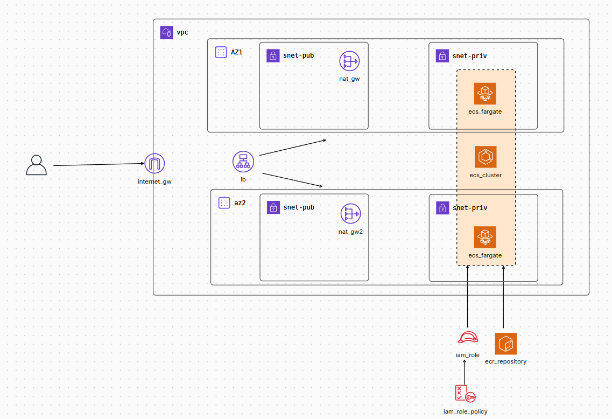

# Infra-Nimbux

En este respositorio se encuentra la infraestructura a deployar en AWS, con Terraform, de la App-Nimbux.

## A tener en cuenta

- **deploy.yml**: aca se encuentra la configuracion del pipeline de Github Actions.
- ***.tf**: son todos los archivos modularizados para la creacion de la infraestructura.
- **secrets**: se utilizaron los secrets de Github.

### deploy.yml

Se utiliza para correr de manera automatica los pasos correspondientes a deployar la infraestructura en AWS

- Terraform init
- Terraform plan
- Terraform apply
- Terraform destroy (opcional, tiene un timer de 30m)

### .tf files

Utilizo una VPC con 4 subnets, 1 publica + 1 privada para 2 AZ's. En las privadas se deployaran los contenedores del ECS, utilizando FARGATE, y en las publicas estaran los 2 NAT Gateways para que dichos contenedores tengan acceso a internet de una manera segura. Estos contenedores tomaran la imagen de ECR.

Las conexiones a las AZ's seran distribuidas por un Application Load Balancer el cual estara conectado con un Internet Gateway para poder acceder a la aplicacion de manera publica (web/HTTP). 

Se configuro la asociacion de las tablas de ruteo entre las subredes. \
Se creo un Rol con su policy para poder trabajar con ECS.

Al terminar de correr el pipeline, se devolvera la DNS del ALB para que se pueda acceder a la aplicacion.

### Visualizacion grafica de la infraestructura

### En caso de test

El respositorio esta automatizado de modo que si se hace un push a *main*, este ejecutara el pipeline con los pasos correspondientes a deployar la infraestructura. \
**IMPORTANTE** se deben configurar previamente los secrets.
- AWS_ACCESS_KEY_ID
- AWS_SECRET_ACCESS_KEY
- AWS_REGION (no modificar, es default, *us-east-1*)
- ECR_REGISTRY (*account-id.dkr.ecr.us-east-1.amazonaws.com/hello-world*)

En caso de querer correrlo en **local**:
- clonar el respositorio
- configurar las variables de acceso y region con *aws configure*
- correr *terraform init*
- correr *terraform plan -var ecr_name_value="<-nombre-registry-ecr->"*
- correr *terraform apply -var ecr_name_value="<-nombre-registry-ecr->"*
- al finalizar se devolvera un link/dns para acceder a la app (suele tardar unos minutos).
- en caso de eliminar la infra, *terraform destroy -var ecr_name_value="<-nombre-registry-ecr->"*
- **IMPORTANTE** se debe pushear la imagen a ECR previamente, sino se recibira un 503.